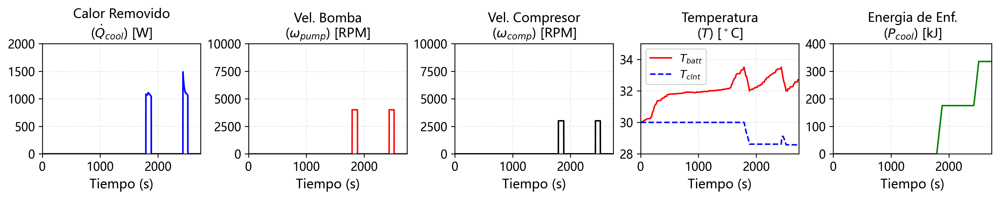
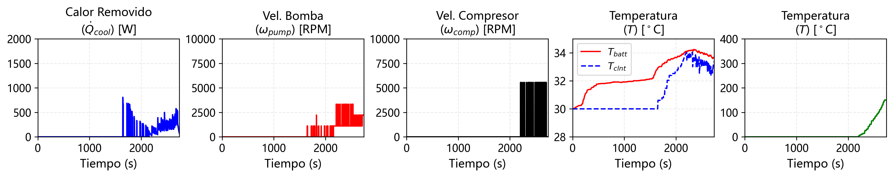
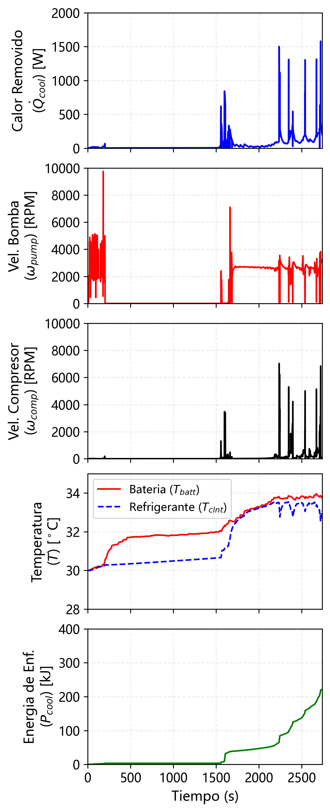
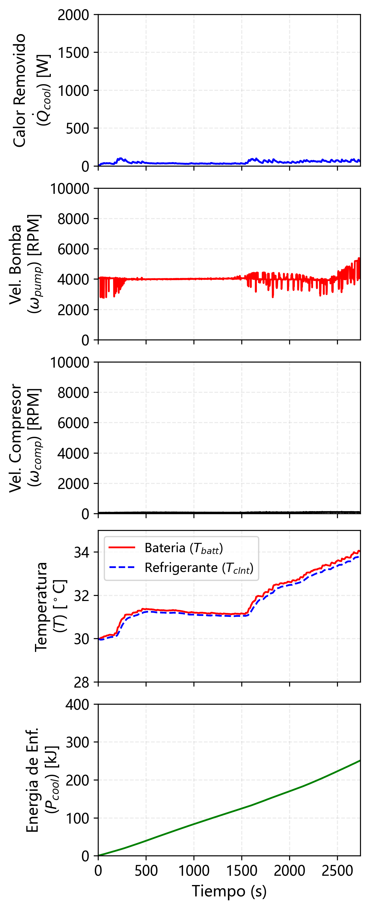

## Battery Thermal Management System (BTMS)

This repository provides a simulation and *benchmarking framework* for advanced control strategies applied to **battery thermal management systems (BTMS)** in electric vehicles.

The framework is built around a high‑fidelity lithium‑ion battery thermal model and is designed to enable **fair, reproducible comparisons** between classical model‑based control methods and modern data‑driven approaches under identical operating conditions.

A central focus of this work is **Stochastic Model Predictive Control (SMPC)**, where exogenous disturbances are modeled as random variables with known or estimated probability density functions over a compact support. This allows uncertainty to be handled explicitly while maintaining constraint satisfaction with probabilistic guarantees.

In contrast, **reinforcement learning (RL)** methods learn control policies directly from interaction with the environment, without requiring an explicit disturbance model, trading analytical guarantees for flexibility and scalability.

---

## Key Features

All controllers are evaluated on the same BTMS model and driving cycles to ensure meaningful comparisons.

Implemented control strategies include:

* **Stochastic Model Predictive Control (SMPC)** with explicit uncertainty modeling
* **Deterministic Model Predictive Control (DMPC)** baselines
* **Dynamic Programming (DP)**, including backward (non‑causal) optimal benchmarks
* **Reinforcement Learning**, based on policy‑gradient methods (Soft Actor‑Critic)

The framework highlights trade‑offs in _performance, robustness, optimality, and practical deployability_ across different control paradigms.

---

## Repository Structure

```text
predictive-control
├── control
│   ├── baselines              # Classical and heuristic controllers
│   ├── casadi                 # MPC & SMPC implementations (CasADi)
│   ├── jax                    # Dynamic programming & RL (JAX)
│   │   ├── env                # Simulation environments
│   │   ├── system             # Battery and thermal dynamics (JAX)
│   │   └── reinforcement_learning
│   │       ├── train.py       # RL training entry point
│   │       └── finetune.py    # RL fine‑tuning
│   └── utils                  # Shared utilities
├── results                    # Saved models, logs, and figures
└── README.md
```

CasADi and JAX implementations are **intentionally separated** to preserve numerical clarity and avoid mixing symbolic and autodiff backends.

---

## How to Run

All scripts must be executed **from the repository root** to ensure correct module resolution.

```bash
cd predictive-control
```

### Classical & Stochastic MPC (CasADi)

Run deterministic and stochastic MPC baselines:

```bash
python -m control.casadi.main
```

This script:

* Simulates thermostat, DMPC, and SMPC controllers
* Uses identical driving cycles and constraints
* Produces temperature and control plots in `results/`

---

### Reinforcement Learning — Training (JAX)

Train a Soft Actor‑Critic (SAC) policy:

```bash
python -m control.jax.reinforcement_learning.train \
  --name sac \
  --horizon 10 \
  --total_steps 1000000
```

Training outputs are saved to:

```text
results/sac_h10/
├── model.zip
├── metrics.png
└── history.pkl
```

---

### Reinforcement Learning — Fine‑Tuning

Continue training from an existing checkpoint:

```bash
python -m control.jax.reinforcement_learning.finetune \
  --name sac \
  --horizon 10
```

Fine‑tuned models are saved under:

```text
results/sac_h10/finetune/
```

---

### Controller Comparison Experiments

Compare thermostat, DP, and trained RL policies:

```bash
python control/jax/experiments.py
```

This script evaluates all controllers on the same driving cycle and reports both **performance and execution time**.

---

## Results

Representative temperature regulation results are shown below:

| Thermostat                                                  | Dynamic Programming                                 | SMPC                                                  | SAC                                                     |
| ----------------------------------------------------------- | --------------------------------------------------- | ----------------------------------------------------- | ------------------------------------------------------- |
|  |  |  |  |

The **dynamic programming solution** serves as a non‑implementable lower bound on achievable cost. **SMPC** demonstrates robust constraint handling under uncertainty, while **SAC** highlights the strengths and limitations of model‑free learning in safety‑critical thermal control problems.

---

## Scope and Design Notes

* This codebase is intended for **research and academic benchmarking**
* CasADi and JAX versions are not unified by design (mixing them is cumbersome and overcomplicated)
* The emphasis is on **clarity, correctness, and reproducibility**, rather than deployment abstraction

---

## License

This code accompanies an academic thesis and is shared for transparency
and reproducibility. It may be read and cited, but not reused, modified,
or redistributed without explicit permission from the author.
